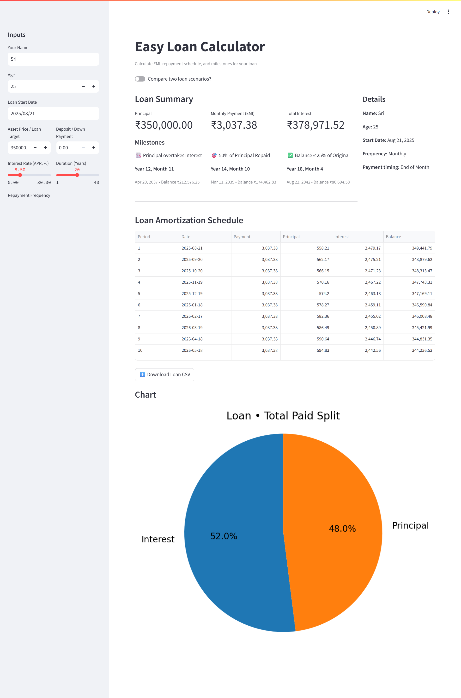
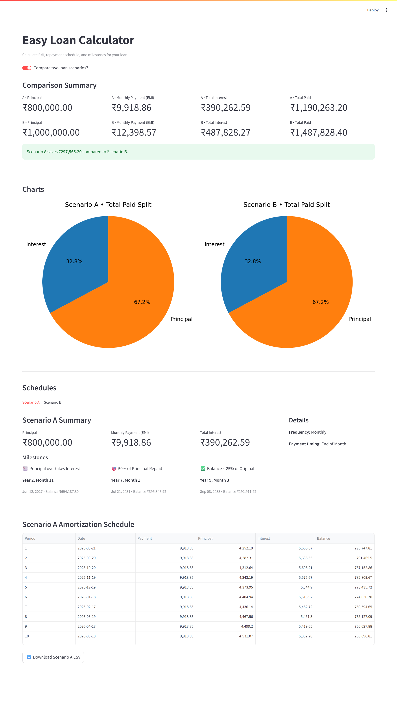

# 💸 Easy Loan Calculator

An interactive **loan calculator app** built with [Streamlit](https://streamlit.io/) and Python.  
It helps you calculate **EMI**, view detailed **amortization schedules**, compare **loan scenarios** with clear visuals and track important **loan milestones**.

##  Live Demo

👉 [**Try the app here**](https://easy-loan-calculator.streamlit.app/)  

---

## Features

- **EMI & Repayment Schedule**  
  Calculate Equated Monthly Installments (EMI) and generate a detailed amortization table with period-wise breakdown.

- **Comparison Mode**  
  Analyze and compare **two different loan scenarios** side by side, with summaries, charts, and schedules.

- **Detailed Loan Summary**  
  View key figures like principal, EMI/payment per period, total interest, and total repayment.

- **Milestones**  
  Track important repayment points:  
  -  When principal overtakes interest  
  -  50% of principal repaid  
  -  Balance ≤ 25% of original loan  

- **Visual Charts**  
  Compact pie chart highlighting the split between **Principal vs Interest**.

- **Downloadable Results**  
  Export amortization schedules to **CSV** for offline use.

- **User Experience**  
  - Sidebar inputs for quick edits  
  - Clean, responsive layout with clear summaries

## Demo & Screenshots

### Single Loan Mode

### Compare Mode

👉 More screenshots available in the [output-images folder](output-images).

